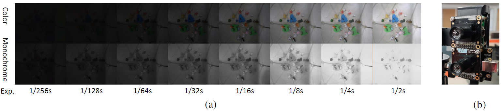

# Abandoning-the-Bayer-Filter-to-See-in-the-Dark

This is the official implementation of  Abandoning the Bayer-Filter to See in the Dark.

This code includes the training and testing procedures of our network on our Mono-colored raw Paired dataset (MCR).

it will be released if this paper be accepted. Also, some images in ours dataset will be included for demo test.

## Requirments
This is the Pytorch implementation of our work. The next requirments and some other frequently-used Library will be needed.
1. Python 3.7
2. Pytorch 1.7.1
3. cuda 11.2
4. numpy 1.20.0
5. scikit-image 0.18.1
6. imageio 2.9.0
...

## Setup


### Dataset

We propose the **MCR**, a dataset of colored raw and monochrome raw image pairs, captured with the same exposure setting. 
 
Here is an exsample of the images in our MCR dataset:



We assemble the color camera and the monochrome camera up and down, setting the same exposure times and gain in the same scene.

Every scene will have 8 different exposure times setting from 1/256s to 1/2s.

For visibility, we convert input raw iamges into RGB images in (a).

And we choose the monochrome GT and RGB GT under the longest exposure time.

The file name contains the image information. Take the image name:"C00001_48mp_0x8_0x1fff.tif" as an example.

"C" means it is color raw image;

"00001" is the image number; 

"48mp" is the master clock frequency 48 MHz; 

"0x8" is the hex number of global gain; 

"0x1fff" indicate the shutter width of the camera which can calculate the exposure time. 

For visual convenience, we convert raw files into '.tif' files which have the same 'RGGB' Bayer-filter pattern as the raw files.

The relationship between shutter width and the exposure time is shown in the table below.  


"dataset example"

The first 2 rows represent the exposure time settings in the indoor scenes which image number is between 1 and 499, the last 2 rows represent outdoor scenes' exposure time settings.

### Training & Testing 
Need 36G RAM to load all the dataset.

Because our dataset has not been published yet, we provide our train&test code just for viewing. 

The 'random_path_list' contain the split train&test lists in our dataset.

### Demo
Still, some low-light images in our dataset are given for demonstration as well as the weights of our model train on our dataset.

The saved model weights is in the 'result/weights' folder, and the low-light images are in the 'test_images/input' folder.

```Shell
python test_demo_images.py
```
The enhanced low-light images will be saved in the 'test_images/result' folder.

For more visual details, please refer to our Supplementary PDF.

