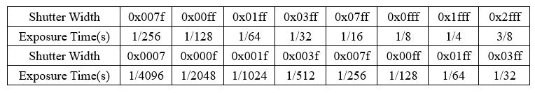

# Learning to Erase the Bayer-Filter to See in the Dark (CVPR 2022)

**Paper:** https://arxiv.org/abs/2203.04042

This code includes the training and testing procedures of our network on our Mono-colored raw Paired (MCR) dataset and [SID](https://github.com/cchen156/Learning-to-See-in-the-Dark) dataset's Sony part.

## Requirments
This is the Pytorch implementation of our work. The next requirments and some other frequently-used Library will be needed.
1. Python >= 3.7
2. Pytorch >= 1.7.1
3. scikit-image 0.18.1
4. imageio 2.9.0
5. rawpy 0.17.0
...

## Dataset

We propose the **MCR** 
[[Google Drive](https://drive.google.com/file/d/1_GWW1P1kjVBMFfN9AuaFq29w-kQ31ncd/view?usp=sharing),
[Baidu Netdisk](https://pan.baidu.com/s/1b3cmUenebeDT_8HdLGa9dQ) (Extraction code: 22cv)],
a dataset of colored raw and monochrome raw image pairs, captured with the same exposure setting. Each image has a resolution of 1280×1024.

The zip file contain 3 parts:
- Mono_Colored_RAW_Paired_DATASET
  - RGB_GT (498 images)
  - Mono_GT (498 images)
  - Color_RAW_Input (498 × 8 images)

Totally 498 different scens, each scene has 1 corresponding RGB and Monochrome ground truth and 8 different exposure color Raw inputs.

We assemble the color camera and the monochrome camera up and down, setting the same exposure times and gain in the same scene.

And we choose the monochrome GT and RGB GT under the longest exposure time.

The file name contains the image information. Take the image name:"C00001_48mp_0x8_0x1fff.tif" as an example.

"C" means it is color raw image;

"00001" is the image number; 

"48mp" is the master clock frequency 48 MHz; 

"0x8" is the hex number of global gain; 

"0x1fff" indicate the shutter width of the camera which can calculate the exposure time. 

For visual convenience, we convert '.raw' files to '.tif' files which have the same 'RGGB' Bayer-filter pattern as the raw files.

The relationship between shutter width and the exposure time is shown in the table below.  

The first 2 rows represent the exposure time settings in the indoor scenes which image number is between 1 and 499, the last 2 rows represent outdoor scenes' exposure time settings.

## Alignment
We propose our alignment code for color and monochrome images taken by 2 cameras under the same scene.

`Alignment/raw` folder contain samples of color and monochrome raw images in one scene.

Firstly,in `convert_RAW.py`, we reshape the flatten '*.raw' files into '1280×1024' and save as '*.tif' files, and then we use the 'exiftool.exe' to add the head info 'pbpx_exft_args.txt' and save the images as '*.dng' and '*.jpg' files.

Secondly, in `alignment.py`, we choose two '*.jpg' images from color and monochrome, and use opencv to calculate the homograph to do the alignment for monochrome images.

## Training & Testing 

For fully loading our dataset, 36G RAM are needed.

The 'random_path_list' contain the split train&test path lists in our dataset.

We split 3984 pairs of our dataset into `train set`: 3600 pairs and `test set`: 384 pairs

We train and test our **MCR** dataset with `train.py` and `test.py`, and we also train our network on SID dataset's Sony part with `train_on_SID.py` and `test_on_SID.py`.

## Citation
If you find this project useful in your research, please consider citing:

## License
 This work is licensed under a <a rel="license" href="http://creativecommons.org/licenses/by-nc/4.0/">Creative Commons Attribution-NonCommercial 4.0 International License</a>.

